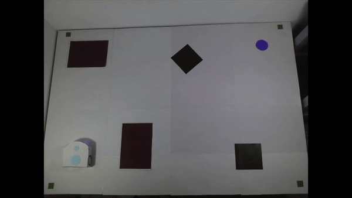

# Basics of mobile robotics - Final project

## Thymio - Vision Guided Navigation

> **Students : Cécile Chavane, Yucef Grebici, Camille Guillaume, Théo Hermann**
>
> (Names in alphabetical order)

### Overview

This project combines vision, path planning, local navigation, and filtering to control a Thymio robot on a map towards a goal.

For the implementation: the image of the experimental environment is first captured by the webcam. The necessary map information, including the robot pose, map, static obstacles, and the goal position, is then extracted in a real-time fashion by using the classic image processing techniques. Afterward, the Visibility Graph algorithm computes the optimal path. It sends the instructions for the global controller of the Thymio robot, which gives instructions to the motors to follow the optimal path. If Thymio detects an obstacle ahead via the proximity sensors, local navigation will take over the robot's movement to avoid collisions.

### Demo

|                                    |                    |
| ---------------------------------- | ------------------ |
| Test                               | Demo               |
| Image Processing from Webcam       |  |
| Global Navigation                  |     |
| Local Navigation                   |     |
| Navigation with Kalman             |     |

**The demo video is available at [`MobileRob_Demo_Video.mp4`](add path).**

**The demo video is available at [https://www.youtube.com/watch?v=Man3UVuFPOw](add path).**

